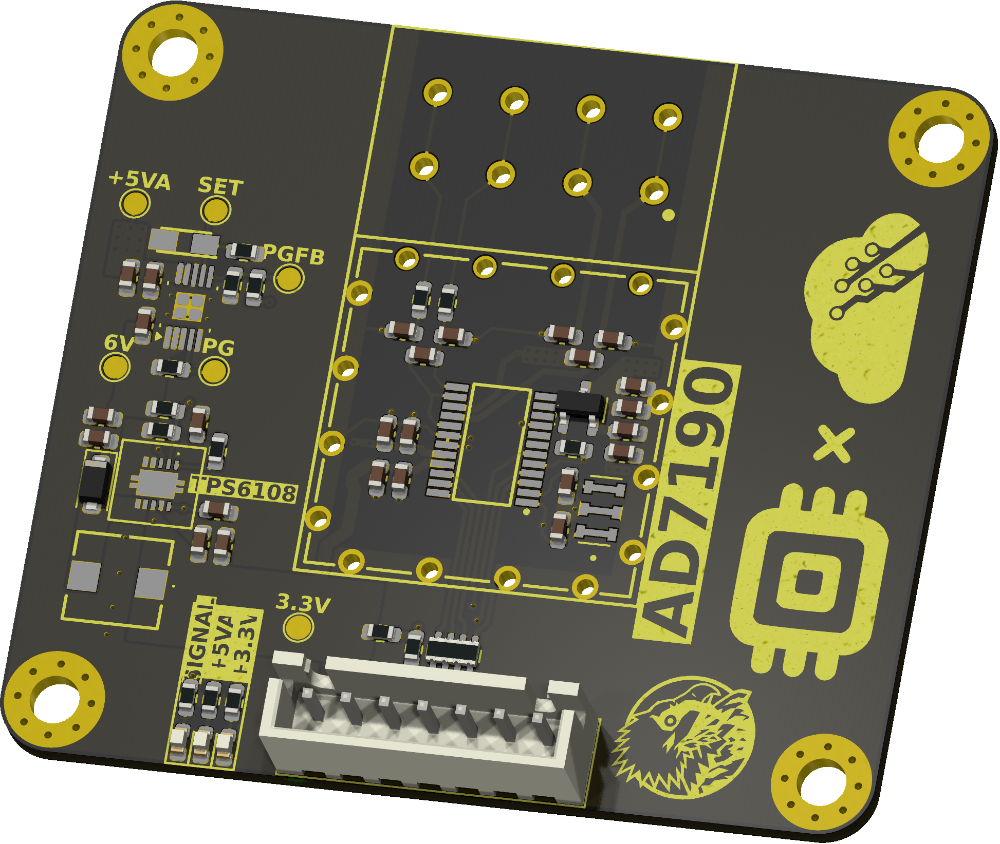
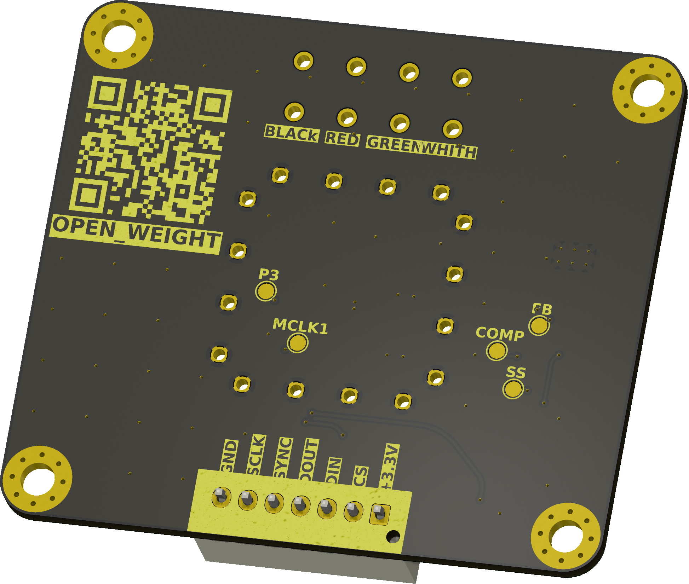

<p align="center" width="100%">
  
</p>

<h1 align="center">OPEN_WEIGHT – AD7190</h1>

<p align="center">
  High-precision load-cell / force measurement PCB based on the AD7190
</p>

<p align="center">
  Sub-project of <a href="https://opentruslab.vercel.app/">OPEN THRUST LAB</a>
</p>

<p align="center" width="100%">
  <a href="https://github.com/foukouda/OPEN_WEIGHT/actions/workflows/ci.yaml">
    
  </a>
  <a href="LICENSE">
    
  </a>
  <a href="https://github.com/foukouda/OPEN_WEIGHT/releases">
    
  </a>
  
  
</p>

<p align="center" width="100%">
    
</p>

***

<p align="center">
  
&nbsp; &nbsp; &nbsp; &nbsp;
  
</p>

***

## OVERVIEW

**OPEN_WEIGHT** is an open-hardware measurement board developed as part of **OPEN THRUST LAB**, a community-driven project focused on building open-source test benches for drone motor characterization.

This board is designed around the **Analog Devices AD7190**, a high-resolution 24-bit sigma-delta ADC optimized for precision bridge-sensor and load-cell measurements. Within the Open Thrust Lab ecosystem, OPEN_WEIGHT serves as the dedicated **force / thrust measurement interface**, enabling accurate acquisition from load cells for bench instrumentation and motor performance analysis.

The board requires only a **3.3 V input** from the host system. An onboard TPS61086 boost converter steps this up to 6 V, which is then regulated down to a clean +5 V analog supply by an LT3042 ultralow-noise LDO. This two-stage architecture deliberately trades a small efficiency cost for a significantly cleaner AVDD rail, which directly reduces the measurement noise floor. No external 5 V supply is needed.

The repository is structured as a full hardware project rather than a simple PCB dump. It includes:
- KiCad 9 source files for schematic and PCB layout
- manufacturing and assembly outputs
- generated schematic and fabrication documentation
- validation reports and test artifacts
- 3D views and project visuals
- automated output generation through **KiBot**
- CI integration for reproducible deliverables

OPEN_WEIGHT is meant to be:
- reproducible
- inspectable
- manufacturable
- easy to iterate on
- aligned with open-hardware development practices

***

## PROJECT CONTEXT

OPEN THRUST LAB is an open-source drone motor test-bench initiative covering hardware, firmware, sensors, data, and analysis. Inside this larger architecture, **OPEN-WEIGHT** is the sub-project dedicated to **precision thrust measurement** — an open-source load-cell amplifier and measurement PCB designed for integration into the bench.

In the broader bench roadmap, this board contributes to the measurement chain used to characterize motor performance through reliable sensor acquisition and fully documented hardware design.

***

## DESIGN GOALS

- Provide a precise measurement front-end for load-cell based force sensing
- Operate entirely from a 3.3 V host rail — no external analog supply required
- Support thrust instrumentation in a modular test-bench architecture
- Expose a clean and reusable KiCad 9 project structure
- Automate hardware deliverables with KiBot and CI
- Make fabrication and assembly easier through fully generated outputs
- Support future revisions, validation, and characterization work

***

## SPECIFICATIONS

### Electrical specifications

| Parameter | Value |
| --- | --- |
| Input voltage (VIN) | 3.3 V (from host system) |
| Boost output — TPS61086 | 6 V |
| Analog supply — LT3042 (AVDD) | 5 V, ultralow-noise |
| Digital supply (DVDD) | 3.3 V (from host) |
| ADC | AD7190, 24-bit sigma-delta |
| PGA gain range | 1 – 128 |
| Voltage reference | Internal, 2.5 V |
| Digital interface | SPI — Mode 3 (CPOL=1, CPHA=1), max 5 MHz |
| Additional SPI signal | SYNC — filter reset / multi-device synchronization |
| Crystal frequency | 4.9152 MHz (external) |
| Load cell excitation control | Onboard P-MOS drive gate (active-low enable) |
| Sensor type | 4-wire Wheatstone bridge |

### Power budget

Power chain: **+3.3 V (host) → TPS61086 → +6 V → LT3042 → +5VA → AD7190**

| Stage | Input rail | Typical current | Typical power |
| --- | --- | --- | --- |
| AD7190 analog (AVDD, gain=128, ODR=10 Hz) | +5VA | ~4 mA | ~20 mW |
| Crystal + RC filters + misc analog | +5VA | ~1 mA | ~5 mW |
| Load cell excitation (4-wire bridge, ~350 Ω) | +5VA | ~14 mA | ~70 mW |
| LT3042 quiescent | +6V | ~2 mA | ~12 mW |
| **LT3042 total input load** | **+6V** | **~21 mA** | **~126 mW** |
| AD7190 digital (DVDD) | +3.3V | ~1 mA | ~3.3 mW |
| TPS61086 input (η ≈ 85–90 % at this load) | **+3.3V** | **~45–50 mA** | **~148–165 mW** |
| **Board total estimated** | **+3.3V** | **~46–51 mA** | **~151–168 mW** |

> **Note:** Load cell excitation current depends on bridge resistance. The estimate above assumes a 350 Ω full bridge at 5 V excitation (~14 mA). A 1000 Ω bridge draws ~5 mA instead, reducing total board consumption significantly. TPS61086 efficiency is estimated from the datasheet curve at Vin=3.3 V, Vout=6 V. Always measure at your specific operating point using the **+3.3V_IN** test point on Page 6.

### Physical specifications

| Parameter | Value |
| --- | --- |
| Project name | OPEN_WEIGHT |
| Board name | AD7190 |
| Parent project | OPEN THRUST LAB |
| CAD tool | KiCad 9 |
| Automation tooling | KiBot + GitHub Actions |
| Dimensions | 57.0 × 50.75 mm |
| Mounting holes | 4× M3, connected to GND |
| Fiducials | 3× top copper, 3× bottom copper |
| Repository status | In active development |
| Hardware licence | CERN-OHL-P v2 |

***

## SCHEMATIC ARCHITECTURE

The project is organized into six hierarchical KiCad sheets:

| Page | Section | Description |
| --- | --- | --- |
| 4 | `AD7910_Weight_sensor` | AD7190 24-bit sigma-delta ADC front-end for Wheatstone bridge acquisition. Differential inputs on SENSE± and OUT± lines with RC input filtering. SPI interface (CS, DIN, DOUT, SCLK, SYNC). External 4.9152 MHz crystal. Dual-supply decoupling (+5VA analog / +3.3V digital). P-MOS drive gate for load cell excitation control. Test points on all critical analog and digital nodes. |
| 5 | `LT3042_6V_5VA` | Low-noise 5 V analog supply for ADC front-end (AVDD). LT3042 ultralow-noise LDO (PSRR > 75 dB). Input: +6V from boost stage. Output: +5VA regulated via RSET = 50 kΩ (ISET = 100 µA). Solid tantalum capacitor on SET pin for noise suppression. Power-Good monitoring via PGFB divider. Test points: VIN, VOUT, SET, PGFB, PG. |
| 6 | `TPS61086_3.3V_to_6V` | 3.3 V to 6 V synchronous boost converter supplying the LT3042 stage. TPS61086 switching at 1.2 MHz fixed frequency (PWM/PFM selectable via MODE pin). Integrated 2.5 A / 0.13 Ω power switch. Output voltage set via FB resistor divider. Input/output decoupling, soft-start, and loop compensation network. Test points: +3.3V_IN, +6V_OUT, FB, COMP. |
| 7 | `Holes, Fiducials` | Mechanical references for PCB fabrication and assembly. Four GND-connected mounting holes (H1–H4, M3). Three fiducial markers on top copper (FID1–FID3) and three on bottom copper (FID4–FID6) for pick-and-place alignment. |
| 8 | `Connecteur` | External interface connectors for load cell and host communication. Load cell 4-wire bridge connector (N-SENSE+, N-SENSE−, N-OUT+, N-OUT−). SPI host header (SS, DIN, DOUT, SCLK, SYNC, +3.3V, GND). PCB frame connector (WE-SMCJTHT) for chassis ground bonding. |

***

## LOAD CELL CONNECTION

The board accepts any standard **4-wire Wheatstone bridge** load cell.

### Bridge connector pinout

| Pin | Signal | Description |
| --- | --- | --- |
| 1 | EXC+ / N-OUT+ | Bridge excitation positive — driven from +5VA via P-MOS gate |
| 2 | EXC− / N-OUT− | Bridge excitation negative — GND reference |
| 3 | SIG+ / N-SENSE+ | Bridge signal positive — routed to AD7190 differential input |
| 4 | SIG− / N-SENSE− | Bridge signal negative — routed to AD7190 differential input |

> ⚠️ Load cell cable colors vary by manufacturer. Always verify EXC± and SIG± with a multimeter **before** powering the board.

> ⚠️ The load cell excitation is switched by a **P-MOS drive gate** on Page 4. This gate must be asserted by the host (active-low) before any measurement. Do not enable excitation during internal calibration.

### Compatible load cell characteristics

- Differential output: **0 – 20 mV/V** at rated excitation
- Bridge resistance: **120 Ω to 1000 Ω** full bridge
- With PGA gain 128 and AVDD = 5 V: full-scale differential input ≈ ±19.53 mV

### SPI host header pinout

| Pin | Signal | Direction | Notes |
| --- | --- | --- | --- |
| 1 | +3.3V | Power in | Host supply to board DVDD |
| 2 | SS (CS̄) | Input | Active low — enables SPI communication |
| 3 | DIN (MOSI) | Input | Serial data to AD7190 |
| 4 | DOUT (MISO) | Output | Serial data from AD7190 |
| 5 | SCLK | Input | SPI clock, max 5 MHz |
| 6 | SYNC | Input | Active low — resets the digital filter and output shift register. Use to synchronize multiple AD7190 devices, or to force a clean filter restart after any configuration change. |
| 7 | DRDȲ | Output | Active low — asserted when a conversion result is ready. Always poll before reading data. |
| 8 | GND | — | Common ground |

> ⚠️ SPI Mode 3 only (CPOL=1, CPHA=1). Data is valid on the falling edge of SCLK.

***

## STARTUP SEQUENCE

After 3.3 V is applied, allow the following stages to complete before issuing any SPI command:

| Stage | Duration | Indicator |
| --- | --- | --- |
| TPS61086 boost startup | ~1–3 ms | +6V_OUT reaches 6 V |
| LT3042 LDO settling | ~1–2 ms after +6V stable | PG pin goes high |
| Crystal stabilization | ~2–5 ms | — |
| **Minimum safe delay** | **≥ 20 ms** from power-on | All rails stable |

After the delay, the recommended initialization sequence is:

```
1. Issue AD7190 serial reset: assert CS̄, write 40+ bytes of 0xFF on DIN
2. Write CONF register (gain, reference, chop settings)
3. Write MODE register (filter, ODR)
4. Run internal zero-scale calibration — wait for DRDȲ
5. Run internal full-scale calibration — wait for DRDȲ
6. Enable P-MOS drive gate (load cell excitation)
7. Run system calibration with known reference weight
8. Enter continuous conversion mode
```

***

## CALIBRATION

Two levels of calibration are required. Both must be repeated after every power cycle.

### 1. Internal calibration

Corrects the ADC's own offset and gain. Requires no external weights. Must be re-run after any change to PGA gain or ODR.

```
Write MODE register: MD[2:0] = 0b001  (internal zero-scale)
→ Wait for DRDȲ to go low

Write MODE register: MD[2:0] = 0b010  (internal full-scale)
→ Wait for DRDȲ to go low

Results are saved in the ZERO and FULLSCALE registers.
Read them back to cache for faster subsequent startups.
```

### 2. System calibration

Maps ADC output codes to physical units. Repeat any time the mechanical setup changes.

```
1. Remove all load → average ≥16 samples → raw_zero
2. Apply known weight W_ref → average ≥16 samples → raw_full
3. scale_factor = W_ref / (raw_full − raw_zero)
4. weight = (raw_code − raw_zero) × scale_factor
```

### Recommended register configuration

| Register | Field | Value | Reason |
| --- | --- | --- | --- |
| `CONF` | GAIN[2:0] | `0b111` (128×) | Maximizes resolution for low-sensitivity load cells |
| `CONF` | REF_SEL | `0b0` | Internal 2.5 V reference — no external ref required |
| `CONF` | CHOP | `1` | Reduces offset and drift |
| `MODE` | SINC | `0b11` (SINC4) | Best 50/60 Hz rejection |
| `MODE` | FS[9:0] | `0x00A` | ODR ≈ 10 Hz — rejects mains interference |

> ⚠️ After any change to GAIN, ODR, or filter settings, the sigma-delta pipeline resets. Always re-run internal calibration before taking measurements.

> ⚠️ At gain 128 with internal 2.5 V reference: full-scale input range = **±19.53 mV**. Verify your load cell sensitivity (mV/V) is compatible at your excitation voltage.

***

## HOW TO USE

### Prerequisites

- **KiCad 9** (not backwards-compatible with KiCad 8 or earlier)
- **KiBot** for automated output generation
- **Docker** recommended for reproducible local CI runs
- Debian/Ubuntu or equivalent environment

### Generate outputs locally

```bash
# Default configuration
./kibot_launch.sh

# Specific variant
./kibot_launch.sh --variant CHECKED
```

| Variant | Outputs | ERC/DRC | Typical use |
| --- | --- | --- | --- |
| `DRAFT` | Schematic only | — | Early design work |
| `PRELIMINARY` | Schematic + PCB | — | Layout iterations |
| `CHECKED` | Full | ✓ enforced | Design review, PR validation |
| `RELEASED` | Full | ✓ enforced | Tagged version releases |

### Use a manufactured board

```c
// --- After ≥20 ms from 3.3V power-on ---

// 1. Reset
ad7190_reset();                            // 40× 0xFF on DIN

// 2. Configure
ad7190_write_reg(REG_CONF,
    CONF_GAIN_128 | CONF_CHOP | CONF_REF_INT);
ad7190_write_reg(REG_MODE,
    MODE_SINC4 | MODE_FS_10HZ);

// 3. Internal calibration
ad7190_write_reg(REG_MODE, MODE_INT_ZERO_CAL);
while (drdy_is_high());
ad7190_write_reg(REG_MODE, MODE_INT_FULL_CAL);
while (drdy_is_high());

// 4. Enable load cell excitation
gpio_set(DRIVE_GATE_PIN, LOW);             // P-MOS: active low

// 5. System calibration
uint32_t raw_zero = ad7190_average(16);    // No load
apply_reference_weight();
uint32_t raw_full = ad7190_average(16);
float scale = W_ref / (float)(raw_full - raw_zero);

// 6. Continuous measurement
ad7190_write_reg(REG_MODE, MODE_CONTINUOUS);
while (1) {
    while (drdy_is_high());
    uint32_t raw = ad7190_read_data();
    float weight = (raw - raw_zero) * scale;
}
```

***

## REPOSITORY CONTENT

| Content | Description |
| --- | --- |
| Schematic sources | KiCad hierarchical schematic — 8 sheets |
| PCB layout | KiCad PCB with all production layers |
| Manufacturing | Gerbers, drill tables, BoM, pick-and-place files |
| Validation | ERC/DRC reports, test-point tables |
| 3D exports | STEP files and rendered views |
| Documentation sheets | Block diagram, architecture, power sequencing, revision history |
| CI resources | GitHub Actions workflows, KiBot YAML configurations |
| Computations | Design notes, filter and power budget calculations |

***

## DIRECTORY STRUCTURE

    .
    ├─ Computations       # Design notes, formulas, and power budget calculations
    ├─ HTML               # Generated HTML pages and web outputs
    ├─ Images             # Pictures, renders, and visual assets
    │
    ├─ kibot_resources    # External resources used by KiBot
    │  ├─ colors          # Color themes for KiCad outputs
    │  ├─ fonts           # Fonts used in generated documents
    │  ├─ scripts         # Helper scripts used with KiBot
    │  └─ templates       # Templates for KiBot reports and generated outputs
    │
    ├─ kibot_yaml         # KiBot YAML configuration files
    ├─ KiRI               # KiRI PCB diff viewer files
    │
    ├─ lib                # KiCad footprint and symbol libraries
    │  ├─ 3d_models       # Component 3D models
    │  ├─ lib_fp          # Footprint libraries
    │  └─ lib_sym         # Symbol libraries
    │
    ├─ Logos              # Project logos and branding assets
    │
    ├─ Manufacturing
    │  ├─ Assembly        # BoM, position files, assembly notes
    │  └─ Fabrication     # Gerbers, drill tables, fabrication notes
    │     ├─ Drill Tables
    │     └─ Gerbers
    │
    ├─ Report             # ERC / DRC reports and validation outputs
    ├─ Schematic          # Exported schematic PDFs
    ├─ Templates          # Drawing sheets and title block templates
    ├─ Testing
    │  └─ Testpoints      # Test point tables and documentation
    │
    └─ Variants           # Outputs for project / assembly variants

***

## DEVELOPMENT WORKFLOW

This project uses a reproducible hardware workflow based on **KiCad 9**, **KiBot**, and **GitHub Actions**.

The CI pipeline generates outputs automatically on every push to `dev`. On semantic version tags (e.g. `v1.0.0`), it packages a full release artifact.

**Branch convention:**
- `dev` — main development branch, all work branches off here
- Feature branches: `feat/description`
- Fix branches: `fix/description`
- Releases are tagged on `main` after merging from `dev`

***

## TROUBLESHOOTING

| Symptom | Likely cause | Fix |
| --- | --- | --- |
| Output stuck at 0 or inverted | EXC± wiring error | Verify bridge polarity with multimeter |
| Output always at full-scale | SIG+ / SIG− swapped | Swap the two signal wires |
| Very noisy SPI readings | SPI mode mismatch | Set host to Mode 3 (CPOL=1, CPHA=1) |
| Readings drift over time | No internal cal after power-on | Re-run zero-scale + full-scale internal calibration |
| DRDȲ never goes low | Crystal not oscillating | Reflow 4.9152 MHz crystal; check load capacitors |
| SPI reads 0xFF | CS̄ stuck high or SCLK too fast | Check CS̄ GPIO; reduce SCLK to ≤ 5 MHz |
| 50/60 Hz interference | ODR too high or wrong filter | Use SINC4 + FS = 0x00A (10 Hz ODR) |
| +5VA absent at power-on | TPS61086 not switching | Verify +3.3V_IN; check inductor L1 solder joints |
| +5VA present but noisy | LT3042 SET pin cap issue | Reflow solid tantalum cap on SET pin (Page 5) |
| No excitation on load cell | P-MOS drive gate inactive | Assert DRIVE_GATE control signal (active low) |
| Offset drifts after warmup | Thermal settling | Allow 5–10 min warmup; re-tare before measurements |

***

## CONTRIBUTING

Contributions are welcome — hardware corrections, documentation improvements, firmware examples, and validation reports all add value to the project.

### Requirements

- **KiCad 9** — not backwards-compatible with earlier versions
- Respect existing layer naming, reference designator conventions, and title block format
- All hardware contributions must pass ERC and DRC under the `CHECKED` variant

### Workflow

1. Fork the repository
2. Create a branch off `dev`: `feat/your-description` or `fix/your-description`
3. Make your changes
4. Run `./kibot_launch.sh --variant CHECKED` — resolve all ERC/DRC violations
5. Open a Pull Request against `dev` with a clear description of the change and its rationale

### Reporting issues

Open a GitHub Issue and include:
- Board revision (from silkscreen or revision history sheet)
- Photos or annotated screenshots of the affected area
- Symptom and conditions under which it occurs
- ERC/DRC report if design-related

***

## CHANGELOG

See [CHANGELOG.md](CHANGELOG.md) for the full board revision history following [Keep a Changelog](https://keepachangelog.com/) conventions with semantic versioning.

***

## LICENSE

Hardware design files in this repository are released under the **CERN Open Hardware Licence Version 2 – Permissive (CERN-OHL-P v2)**.

See [LICENSE](LICENSE) for the full licence text.

Under CERN-OHL-P v2:
- You may use, study, modify, and manufacture this design freely
- Derivative works do **not** need to remain open-source
- Modified files must carry a notice identifying the changes made and their author
- The original copyright and attribution notice must be preserved

> For more on CERN-OHL licences: [ohwr.org/cern_ohl](https://ohwr.org/cern_ohl)
